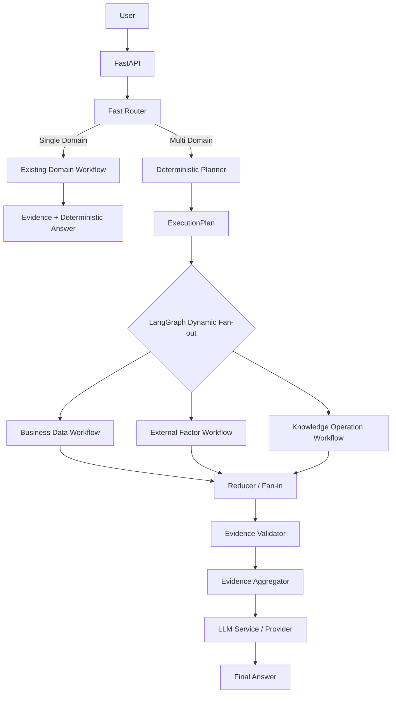

# Restaurant Business AI

餐饮经营数据分析与经营决策 SaaS Agent。当前发布版本为 **v0.1.0-agent-mvp**：三个已验证 Domain 既可走低成本单领域短路径，也可通过 LangGraph Planner、动态 Fan-out/Fan-in、Evidence Validator 和 LLM Aggregator 完成多领域综合回答。

## 项目能力

- Business Data：SQLAlchemy + 只读 SQLite，支持时间范围、营业额、订单、客单价、门店和商品分析
- External Factor：Open-Meteo Current / Forecast，输出 FACT 或 PREDICTION Evidence
- Knowledge & Operation：轻量 RAG、Tenant/Domain Guard、阈值、Citation 和 `NO_KNOWLEDGE`
- Deterministic Planner：根据 Fast Router 的结构化结果生成 `ExecutionPlan`
- LangGraph：仅对真正的多领域问题进行动态并行 Fan-out/Fan-in
- Evidence Layer：统一强类型 Contract，并在聚合前校验 tenant、domain 和数据结构
- Aggregator：只接收已验证 Evidence 和 Domain 状态，通过 OpenAI-compatible LLM Provider 生成回答
- Failure Isolation：单个 Domain 失败不丢弃其他成功 Evidence
- 可观测性：记录计划/完成/失败 Domain、Evidence 数量和可用 LLM token/latency 元数据

## 架构



单领域问题不会调用 Planner 或 LLM。每个多领域分支使用独立 `AgentState`，只通过统一 `DomainExecutionResult` 汇入 reducer，避免并行状态覆盖。

## 目录

```text
app/
├── api/routes/          # FastAPI 路由
├── contracts/           # Evidence、Domain、Orchestration、LLM 契约
├── core/                # 配置、异常、日志
├── domains/             # Business、Weather、Knowledge、LLM Service
├── infrastructure/      # SQLite、Weather、Embedding、Vector Store、LLM Adapter
├── orchestration/       # Planner、LangGraph、Validator、Aggregator
├── routing/             # Fast Router
├── workflows/           # 三条独立 Domain Workflow
└── main.py              # 应用工厂与依赖组装
tests/
├── golden/              # 旧系统 Verified Business Baseline
├── integration/         # API、Multi-Domain、Partial Failure
└── unit/                # Contract、Provider、Service、Orchestration
```

## 安装与运行

推荐 Python 3.11 或 3.12。

```powershell
py -3.12 -m venv .venv
.\.venv\Scripts\Activate.ps1
python -m pip install -r requirements.txt
Copy-Item .env.example .env
uvicorn app.main:app --reload
```

PyCharm 中将 `.venv\Scripts\python.exe` 配置为项目解释器，以项目根目录为 Working directory，启动 `uvicorn app.main:app --reload`。接口文档位于 `http://127.0.0.1:8000/docs`。

核心 `.env` 配置：

```dotenv
APP_DEFAULT_TENANT_ID=dev_tenant
EMBEDDING_PROVIDER=openai_compatible
EMBEDDING_BASE_URL=https://api.openai.com/v1
EMBEDDING_API_KEY=
EMBEDDING_MODEL=text-embedding-3-small
LLM_PROVIDER=openai_compatible
LLM_BASE_URL=https://api.deepseek.com
LLM_API_KEY=
LLM_MODEL=deepseek-v4-flash
```

天气使用 Open-Meteo，无需 API Key。正式多领域聚合需要配置 DeepSeek 或其他 OpenAI-compatible LLM。未配置 `LLM_API_KEY` 时应用仍可启动，三个单领域短路径继续可用，多领域请求返回明确的 `LLM_NOT_CONFIGURED`。

## API 与四个 Demo

统一接口：

```powershell
$body = @{ question = "7月份营业额是多少？" } | ConvertTo-Json
Invoke-RestMethod `
  -Method Post `
  -Uri http://127.0.0.1:8000/api/v1/agent/query `
  -ContentType application/json `
  -Body $body
```

1. `7月份营业额是多少？`
   - Business Data → SQLAlchemy → 只读 SQLite → FACT Evidence
2. `成都明天天气怎么样？`
   - External Factor → Weather Provider → PREDICTION Evidence
3. `会员折扣和满减可以同时使用吗？`
   - Knowledge → Tenant Guard → Citation / `NO_KNOWLEDGE`
4. `明天成都下雨，结合最近营业额和公司的雨天运营规范应该注意什么？`
   - Planner → 三 Domain 并行 → Validator → Aggregator → LLM

Demo 4 的 Aggregator 被要求区分事实、预测和企业知识，并明确说明：没有历史天气与营业额联合样本时，不能把天气直接解释为营业额变化的因果原因，也不能编造定量影响。

## 安全与数据边界

- 客户端不能提交可信 `tenant_id`；开发租户由服务端解析，默认 `dev_tenant`
- `data/moneki.db` 以 SQLite 只读模式打开；Repository 使用 SQLAlchemy Expression，不暴露 raw SQL execute 契约
- Knowledge 检索同时执行 Tenant Guard、Domain Guard、阈值和 Citation 约束
- RAG 内容作为不可信数据进入 Aggregator，不能覆盖 System Prompt 或被当作指令执行
- LLM 仅接收结构化 Validated Evidence，不接收数据库 rows、天气原始 JSON 或完整文档对象
- 日志不记录 API Key

## 测试

```powershell
.\.venv\Scripts\python.exe -m pytest -q -p no:cacheprovider
.\.venv\Scripts\python.exe -m compileall -q app tests
.\.venv\Scripts\python.exe -m pip check
git diff --check
```

测试使用 Fake/Mock Weather、Embedding 和 LLM，不访问真实互联网。Business Golden Tests 使用项目数据库副本，确保新架构结果与旧系统已验证口径一致。

## Demo Knowledge

`data/demo_knowledge/` 中的会员规则和雨天运营规范仅为演示构造内容，不代表真实企业制度。知识索引与经营数据库完全隔离。

## 已知限制与后续路线

当前 MVP 不包含 Historical Weather、天气与营业额联合统计、复杂 Factor Model、Reranker、Hybrid Search、GraphRAG、Qdrant、Redis、生产级持久 Checkpoint 或高级 Router NLP。`knowledge_index.json` 损坏恢复、原子持久化、Embedding 模型/索引版本迁移，以及 HTTP 429 / Retry-After 的统一策略仍是已记录技术债。

版本进入面试发布冻结：后续只修 Bug，不在 v0.1.0-agent-mvp 中继续加入高风险能力。
